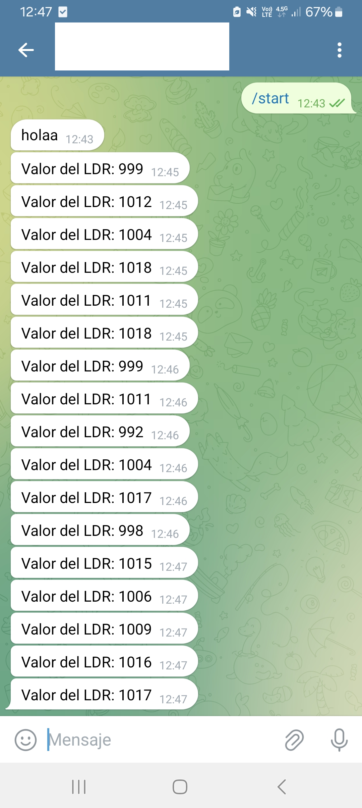

# LDR Telegram Bot con ESP8266

Este proyecto implementa un bot de Telegram que utiliza un ESP8266 para leer el valor de un sensor LDR conectado al pin A0 y envía el estado cada 10 segundos como mensaje al chat de Telegram.

## Características
- Conexión WiFi para la comunicación con la API de Telegram.
- Envío periódico de datos del sensor LDR.
- Compatible con ESP8266.

## Requisitos
- **Hardware**:
  - ESP8266 (ejemplo: NodeMCU o similar).
  - Sensor LDR.
  - Resistencia de 10kΩ para el divisor de voltaje.
- **Software**:
  - Arduino IDE instalado.
  - Librerías de Arduino para ESP8266.

## Instalación
### Configuración del ESP8266
1. Abre el **Arduino IDE**.
2. Instala el soporte para placas ESP8266:
   - Ve a **Archivo > Preferencias**.
   - En la sección de URL adicionales para gestores de tarjetas, añade:
     ```
     http://arduino.esp8266.com/stable/package_esp8266com_index.json
     ```
   - Luego ve a **Herramientas > Placas > Gestor de tarjetas**, busca `ESP8266` y haz clic en **Instalar**.

3. Conecta el ESP8266 a tu computadora.
4. Selecciona la placa correspondiente en **Herramientas > Placa > ESP8266 Boards** y el puerto correcto en **Herramientas > Puerto**.

### Configuración del código
1. Descarga o clona este repositorio:
   ```bash
   git clone https://github.com/leandro-darchivio/sensores-a-telegram.git
   ```
2. Abre el archivo `.ino` en el Arduino IDE.
3. Configura las credenciales de WiFi y el token del bot de Telegram:
   ```cpp
   #define WIFI_SSID "TuSSID"
   #define WIFI_PASSWORD "TuContraseña"

   #define BOT_TOKEN "0000000000:AAEan000000000000000bTrKohYZ6JdV8"
   #define CHAT_ID "150000000000"
   ```
4. Sube el código al ESP8266.

### Cableado
1. Conecta el sensor LDR al pin **A0** del ESP8266 utilizando un divisor de voltaje.
   - Un extremo del LDR al pin A0.
   - Otro extremo al **VCC**.
   - Conecta el resistor de 10kΩ entre el pin A0 y **GND**.




### Librerías necesarias
- No se requieren librerías adicionales para este proyecto.

## Uso
1. Alimenta el ESP8266.
2. El ESP8266 se conectará a la red WiFi y comenzará a enviar mensajes al chat de Telegram configurado cada 30 segundos con el valor del sensor LDR.
3. Puedes ver los datos directamente en tu chat de Telegram.

## Ejemplo de salida
En tu chat de Telegram recibirás mensajes como:
```
Valor del LDR: 512
Valor del LDR: 768
```

## Personalización
- Puedes cambiar el intervalo de tiempo modificando esta línea en el código:
  ```cpp
  if (currentTime - lastLDRTime >= 30000) {
  ```
  Cambia `30000` (milisegundos) por el valor deseado.

## Problemas conocidos
- Si el valor del LDR no cambia, verifica la conexión del sensor o ajusta la resistencia del divisor de voltaje.

## Contribución
¡Las contribuciones son bienvenidas! Si tienes sugerencias o mejoras, abre un issue o un pull request.


---

¡Gracias por usar este proyecto! Espero que sea útil para tus aplicaciones con ESP8266 y Telegram.
